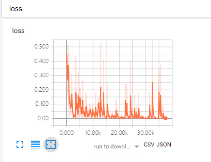

# A clean and beautiful template for pytorch

## How to use

Modify `template.py`, replace the content in the `__init__`method. 

``` python
class Model():

    def __init__(self, args):
        self.writer = tX.SummaryWriter(log_dir=None, comment='')
        self.train_logger = None  # not neccessary
        self.eval_logger = None  # not neccessary
        self.args = args  # not neccessary

        self.step = 0
        self.epoch = 0
        self.best_error = float('Inf')

        self.model = None
        self.optimizer = None
        self.criterion = None
        self.metric = None

        self.train_loader = None
        self.test_loader = None

        self.device = None

        self.ckpt_dir = None
        self.log_per_step = None
```


And then all you need is to write a little traning loop like this:

``` python
def main():
    model = Model()

    for epoch in range(n_epochs):
        model.train()
        if (epoch + 1) % eval_per_epoch == 0:
            model.eval()

    print('Done!!!')
```

## Example

- [LeNet](example/LeNet): Train a LeNet to classify MNIST handwrting digits.

    Training procedure:

    ``` shell
    ......
    epoch 1 step 3400   loss 0.0434
    epoch 1 step 3500   loss 0.0331
    epoch 1 step 3600   loss 0.00188
    epoch 1 step 3700   loss 0.00341
    save model at ../models\best.pth.tar
    save model at ../models\1.pth.tar
    epoch 1 error 0.0237
    epoch 2 step 3800   loss 0.0201
    epoch 2 step 3900   loss 0.00523
    epoch 2 step 4000   loss 0.0236
    ......
    ```

    Use tensorboard to visualize the result:

    ```shell
    tensorboard --logdir example/LeNet/log
    ```

    | train_loss                                      | eval_error                                      |
    | ----------------------------------------------- | ----------------------------------------------- |
    |  |  |


