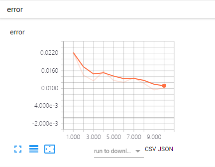

# torchT: A clean and beautiful template for pytorch


## 1. Install

#### 1) Install from source code

``` shell
pip install .
```

or

```
pip install -e .
```

#### 2) Install from PyPi

TODO

## 2. How to use

### 1) Inherit `TemplateModel`

Replace the content in the `__init__`method. 

``` python
from torchT import TemplateModel

class Model(TemplateModel):

    def __init__(self, args):
        # ============== neccessary ===============
        self.writer = None
        self.step = 0
        self.epoch = 0
        self.best_error = float('Inf')

        self.model = None
        self.optimizer = None
        self.criterion = None
        self.metric = None

        self.train_loader = None
        self.test_loader = None

        self.device = None

        self.ckpt_dir = None
        self.log_per_step = None
        
        # ============== not neccessary ===============
        self.train_logger = None
        self.eval_logger = None
        self.args = None
        
        # call it to check all members have been intiated
        self.check_init()
```


### 2) Write training loop

And then all you need is to write a little training loop like this:

``` python
model = Model()

for epoch in range(n_epochs):
    model.train()
    if (epoch + 1) % eval_per_epoch == 0:
        model.eval()

print('Done!!!')
```

### 3) Resume training

Resume training is very convenient, just need to load the saved model.

``` python
model = Model()
if model_path:
    model.load_state(model_path)

for i in range(n_epochs):
    model.train()
    if model.epoch % eval_per_epoch == 0:
        model.eval()
```

### 4) Further specialization

Write your own `train_loss()`and`eval_error()`member methods.

Default methods:

``` python
def train_loss(self, batch):
    x, y = batch
    x = x.to(self.device)
    y = y.to(self.device)
    pred = self.model(x)
    loss = self.criterion(pred, y)

    return loss, None

def eval_error(self):
    xs, ys, preds = [], [], []
    for batch in self.test_loader:
        x, y = batch
        x = x.to(self.device)
        y = y.to(self.device)
        pred = self.model(x)

        xs.append(x.cpu())
        ys.append(y.cpu())
        preds.append(pred.cpu())

    xs = torch.cat(xs, dim=0)
    ys = torch.cat(ys, dim=0)
    preds = torch.cat(preds, dim=0)
    error = self.metric(preds, ys)

    return error, None
```

**How to write your own methods**:

- `train_loss`recieves a `batch`from dataloader as input, return `loss` and `others`which can be used as input for `train_logger`
- `eval_error`return `error` of the whole test dataset and `others`which can be used as input for `eval_logger`

You can refer to the [source code](torchT/template.py) for more details.

## 3. Example

- [LeNet](example/LeNet): Train a LeNet to classify MNIST handwriting digits.

    - Training procedure:

        ``` shell
        ......
        epoch 1 step 3400   loss 0.0434
        epoch 1 step 3500   loss 0.0331
        epoch 1 step 3600   loss 0.00188
        epoch 1 step 3700   loss 0.00341
        save model at ../models\best.pth.tar
        save model at ../models\1.pth.tar
        epoch 1 error 0.0237
        epoch 2 step 3800   loss 0.0201
        epoch 2 step 3900   loss 0.00523
        epoch 2 step 4000   loss 0.0236
        ......
        ```

    - Use tensorboard to visualize the result:

        ```shell
        tensorboard --logdir example/LeNet/log
        ```

        | train_loss                                      | eval_error                                      |
        | ----------------------------------------------- | ----------------------------------------------- |
        |  |  |

    - Resume

        ``` shell
        load model from checkpoint/9.pth.tar
        epoch 10    step 33800  loss 0.000128
        epoch 10    step 33900  loss 6.64e-06
        epoch 10    step 34000  loss 0.000613
        epoch 10    step 34100  loss 2.41e-05
        ......
        ```


